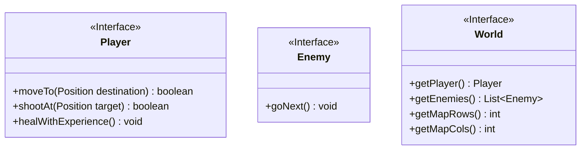

```mermaid
classDiagram

class Player
<<Interface>> Player
Player : +moveTo(Position destination) boolean
Player : +shootAt(Position target) boolean
Player : +healWithExperience() void

class Enemy
<<Interface>> Enemy
Enemy : +goNext() void

class World
<<Interface>> World
World : +getPlayer() Player
World : +getEnemies() List~Enemy~
World : +getMapRows() int
World : +getMapCols() int
```
