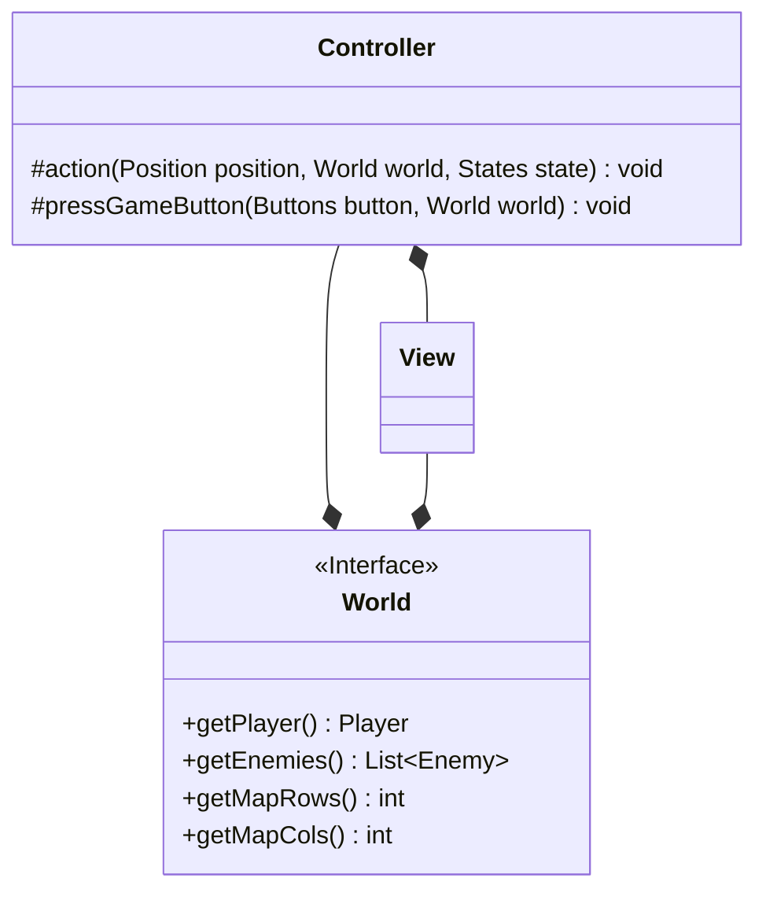

```mermaid
classDiagram

class View

class Controller
Controller --* World
Controller *-- View
Controller : #action(Position position, World world, States state) void
Controller : #pressGameButton(Buttons button, World world) void

class World
<<Interface>> World
View --* World
World : +getPlayer() Player
World : +getEnemies() List~Enemy~
World : +getMapRows() int
World : +getMapCols() int
```
