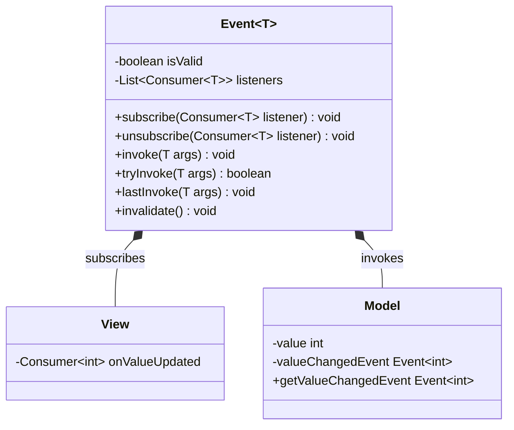

```mermaid
classDiagram

class View
View : -Consumer~int~ onValueUpdated

Event~T~ *-- View : subscribes

class Event~T~
Event : -boolean isValid
Event : -List~Consumer~T~~ listeners
Event : +subscribe(Consumer~T~ listener) void
Event : +unsubscribe(Consumer~T~ listener) void
Event : +invoke(T args) void
Event : +tryInvoke(T args) boolean
Event : +lastInvoke(T args) void
Event : +invalidate() void

Event~T~ *-- Model : invokes

class Model
Model : -value int
Model : -valueChangedEvent Event~int~
Model : +getValueChangedEvent Event~int~
```
