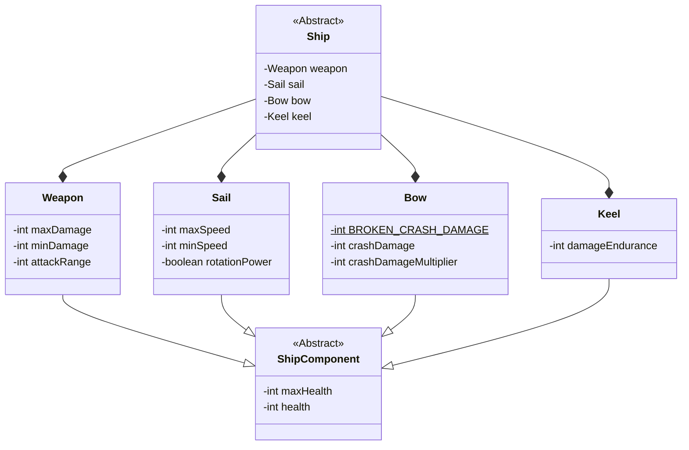

```mermaid
classDiagram

class ShipComponent
<<Abstract>> ShipComponent
ShipComponent : -int maxHealth
ShipComponent : -int health

class Weapon
Weapon --|> ShipComponent
Weapon : -int maxDamage
Weapon : -int minDamage
Weapon : -int attackRange

class Sail
Sail --|> ShipComponent
Sail : -int maxSpeed
Sail : -int minSpeed
Sail : -boolean rotationPower

class Bow
Bow --|> ShipComponent
Bow : -int BROKEN_CRASH_DAMAGE$
Bow : -int crashDamage
Bow : -int crashDamageMultiplier

class Keel
Keel --|> ShipComponent
Keel : -int damageEndurance

class Ship
<<Abstract>> Ship
Ship : -Weapon weapon
Ship --* Weapon
Ship : -Sail sail
Ship --* Sail
Ship : -Bow bow
Ship --* Bow
Ship : -Keel keel
Ship --* Keel
```
