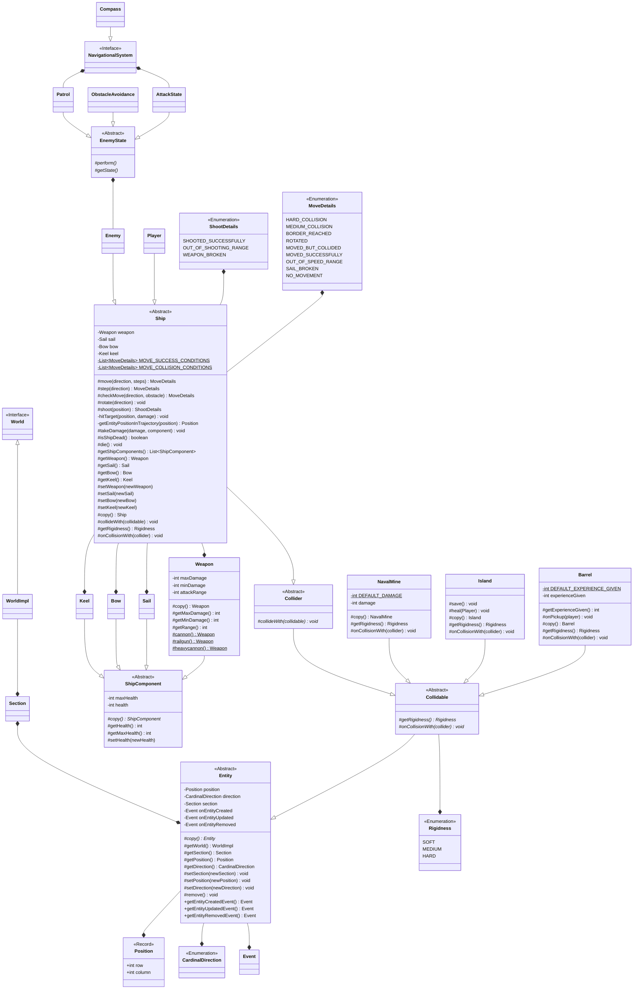

```mermaid
classDiagram

class Entity
<<Abstract>> Entity
Entity : -Position position
Entity --* Position
Entity : -CardinalDirection direction
Entity --* CardinalDirection
Entity : -Section section
Entity --* Event
Entity : -Event onEntityCreated
Entity : -Event onEntityUpdated
Entity : -Event onEntityRemoved
Entity : #copy()* Entity
Entity : #getWorld() WorldImpl
Entity : #getSection() Section
Entity : #getPosition() Position
Entity : #getDirection() CardinalDirection
Entity : #setSection(newSection) void
Entity : #setPosition(newPosition) void
Entity : #setDirection(newDirection) void
Entity : #remove() void
Entity : +getEntityCreatedEvent() Event
Entity : +getEntityUpdatedEvent() Event
Entity : +getEntityRemovedEvent() Event

class Collidable
<<Abstract>> Collidable
Collidable --|> Entity
Collidable --* Rigidness
Collidable : #getRigidness()* Rigidness
Collidable : #onCollisionWith(collider)* void

class Rigidness
<<Enumeration>> Rigidness
Rigidness : SOFT
Rigidness : MEDIUM
Rigidness : HARD

class Barrel
Barrel --|> Collidable
Barrel : -int DEFAULT_EXPERIENCE_GIVEN$
Barrel : -int experienceGiven
Barrel : #getExperienceGiven() int
Barrel : #onPickup(player) void
Barrel : #copy() Barrel
Barrel : #getRigidness() Rigidness
Barrel : #onCollisionWith(collider) void

class Island
Island --|> Collidable
Island : #save() void
Island : #heal(Player) void
Island : #copy() Island
Island : #getRigidness() Rigidness
Island : #onCollisionWith(collider) void

class NavalMine
NavalMine --|> Collidable
NavalMine : -int DEFAULT_DAMAGE$
NavalMine : -int damage
NavalMine : #copy() NavalMine
NavalMine : #getRigidness() Rigidness
NavalMine : #onCollisionWith(collider) void

class Collider
<<Abstract>> Collider
Collider --|> Collidable
Collider : #collideWith(collidable)* void

class Ship
<<Abstract>> Ship
Ship --|> Collider
Ship : -Weapon weapon
Ship --* Weapon
Ship : -Sail sail
Ship --* Sail
Ship : -Bow bow
Ship --* Bow
Ship : -Keel keel
Ship --* Keel
Ship : -List~MoveDetails~ MOVE_SUCCESS_CONDITIONS$
Ship : -List~MoveDetails~ MOVE_COLLISION_CONDITIONS$
MoveDetails *-- Ship
ShootDetails *-- Ship
Ship : #move(direction, steps) MoveDetails
Ship : #step(direction) MoveDetails
Ship : #checkMove(direction, obstacle) MoveDetails
Ship : #rotate(direction) void
Ship : #shoot(position) ShootDetails
Ship : -hitTarget(position, damage) void
Ship : -getEntityPositionInTrajectory(position) Position
Ship : #takeDamage(damage, component) void
Ship : #isShipDead() boolean
Ship : #die() void
Ship : #getShipComponents() List~ShipComponent~
Ship : #getWeapon() Weapon
Ship : #getSail() Sail
Ship : #getBow() Bow
Ship : #getKeel() Keel
Ship : #setWeapon(newWeapon)
Ship : #setSail(newSail)
Ship : #setBow(newBow)
Ship : #setKeel(newKeel)
Ship : #copy() Ship
Ship : #collideWith(collidable) void
Ship : #getRigidness() Rigidness
Ship : #onCollisionWith(collider) void

class MoveDetails
<<Enumeration>> MoveDetails
MoveDetails : HARD_COLLISION
MoveDetails : MEDIUM_COLLISION
MoveDetails : BORDER_REACHED
MoveDetails : ROTATED
MoveDetails : MOVED_BUT_COLLIDED
MoveDetails : MOVED_SUCCESSFULLY
MoveDetails : OUT_OF_SPEED_RANGE
MoveDetails : SAIL_BROKEN
MoveDetails : NO_MOVEMENT

class ShootDetails
<<Enumeration>> ShootDetails
ShootDetails : SHOOTED_SUCCESSFULLY
ShootDetails : OUT_OF_SHOOTING_RANGE
ShootDetails : WEAPON_BROKEN

class ShipComponent
<<Abstract>> ShipComponent
ShipComponent : -int maxHealth
ShipComponent : -int health
ShipComponent : #copy()* ShipComponent
ShipComponent : #getHealth() int
ShipComponent : #getMaxHealth() int
ShipComponent : #setHealth(newHealth)

class Weapon
Weapon --|> ShipComponent
Weapon : -int maxDamage
Weapon : -int minDamage
Weapon : -int attackRange
Weapon : #copy() Weapon
Weapon : #getMaxDamage() int
Weapon : #getMinDamage() int
Weapon : #getRange() int
Weapon : #cannon()$ Weapon
Weapon : #railgun()$ Weapon
Weapon : #heavycannon()$ Weapon

class Sail
Sail --|> ShipComponent

class Bow
Bow --|> ShipComponent

class Keel
Keel --|> ShipComponent

class Player
Player --|> Ship

class Enemy
Enemy --|> Ship
EnemyState *-- Enemy

class EnemyState
<<Abstract>> EnemyState
EnemyState : #perform()*
EnemyState : #getState()*

class AttackState
AttackState --|> EnemyState
NavigationalSystem *-- AttackState

class ObstacleAvoidance
ObstacleAvoidance --|> EnemyState

class Patrol
Patrol --|> EnemyState
NavigationalSystem *-- Patrol

class NavigationalSystem
<<Inteface>> NavigationalSystem

class Compass
Compass --|> NavigationalSystem

class Section
Section *--* Entity

class World
<<Interface>> World

class WorldImpl
WorldImpl --* Section
World <|-- WorldImpl

class Position
<<Record>> Position
Position : +int row
Position : +int column

class CardinalDirection
<<Enumeration>> CardinalDirection

class Event
```
