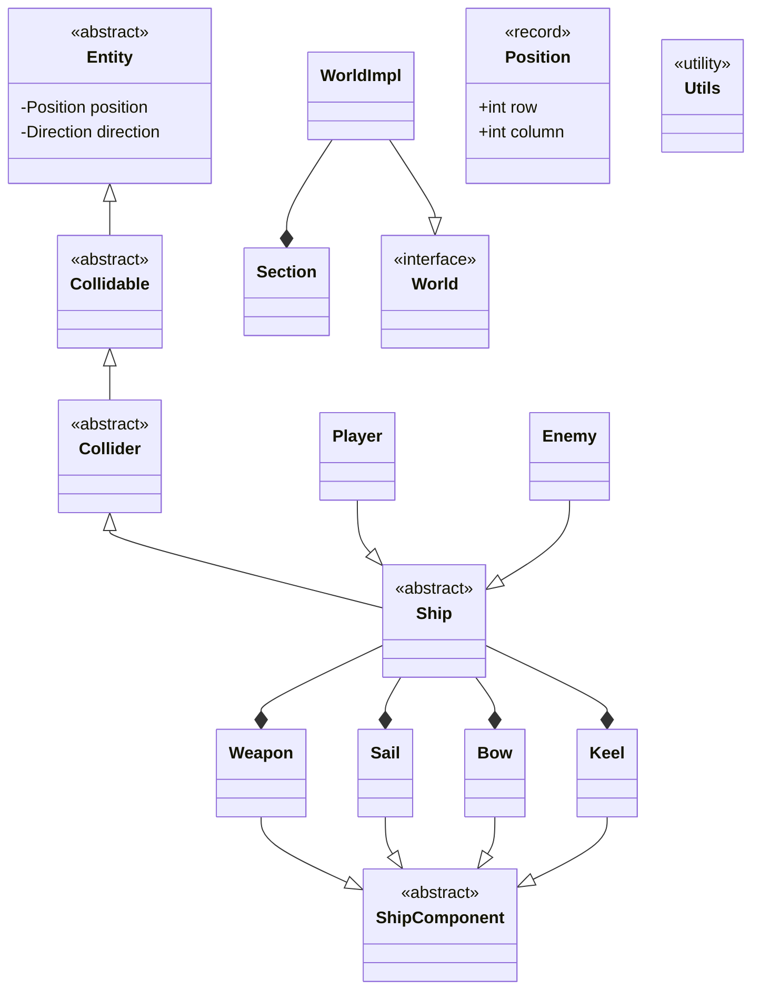

```mermaid
classDiagram

class Entity
<<abstract>> Entity
Entity : -Position position
Entity : -Direction direction

Entity <|-- Collidable
class Collidable
<<abstract>> Collidable

Collidable <|-- Collider
class Collider
<<abstract>> Collider

Collider <|-- Ship
Ship --* Weapon
Ship --* Sail
Ship --* Bow
Ship --* Keel
class Ship
<<abstract>> Ship

class ShipComponent
<<abstract>> ShipComponent

Weapon --|> ShipComponent 
class Weapon

Sail --|> ShipComponent
class Sail

Bow --|> ShipComponent
class Bow

Keel --|> ShipComponent
class Keel

Player --|> Ship
class Player

Enemy --|> Ship
class Enemy

class Section

class World
<<interface>> World

WorldImpl --* Section
WorldImpl --|> World
class WorldImpl

class Position
<<record>> Position
Position : +int row
Position : +int column

class Utils
<<utility>> Utils
```
