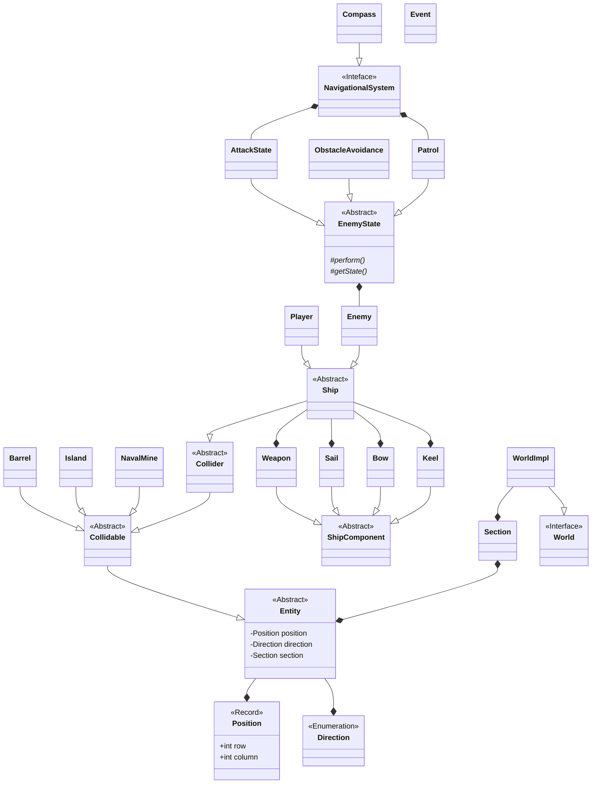

```mermaid
classDiagram

class Entity
<<Abstract>> Entity
Entity : -Position position
Entity --* Position
Entity : -Direction direction
Entity --* Direction
Entity : -Section section

class Collidable
<<Abstract>> Collidable
Collidable --|> Entity

class Barrel
Barrel --|> Collidable

class Island
Island --|> Collidable

class NavalMine
NavalMine --|> Collidable

class Collider
<<Abstract>> Collider
Collider --|> Collidable

class Ship
<<Abstract>> Ship
Ship --|> Collider
Ship --* Weapon
Ship --* Sail
Ship --* Bow
Ship --* Keel

class ShipComponent
<<Abstract>> ShipComponent

class Weapon
Weapon --|> ShipComponent 

class Sail
Sail --|> ShipComponent

class Bow
Bow --|> ShipComponent

class Keel
Keel --|> ShipComponent

class Player
Player --|> Ship

class Enemy
Enemy --|> Ship
EnemyState *-- Enemy

class EnemyState
<<Abstract>> EnemyState
EnemyState : #perform()*
EnemyState : #getState()*

class AttackState
AttackState --|> EnemyState
NavigationalSystem *-- AttackState

class ObstacleAvoidance
ObstacleAvoidance --|> EnemyState

class Patrol
Patrol --|> EnemyState
NavigationalSystem *-- Patrol

class NavigationalSystem
<<Inteface>> NavigationalSystem

class Compass
Compass --|> NavigationalSystem

class Section
Section *--* Entity

class World
<<Interface>> World

class WorldImpl
WorldImpl --* Section
WorldImpl --|> World

class Position
<<Record>> Position
Position : +int row
Position : +int column

class Direction
<<Enumeration>> Direction

class Event
```
