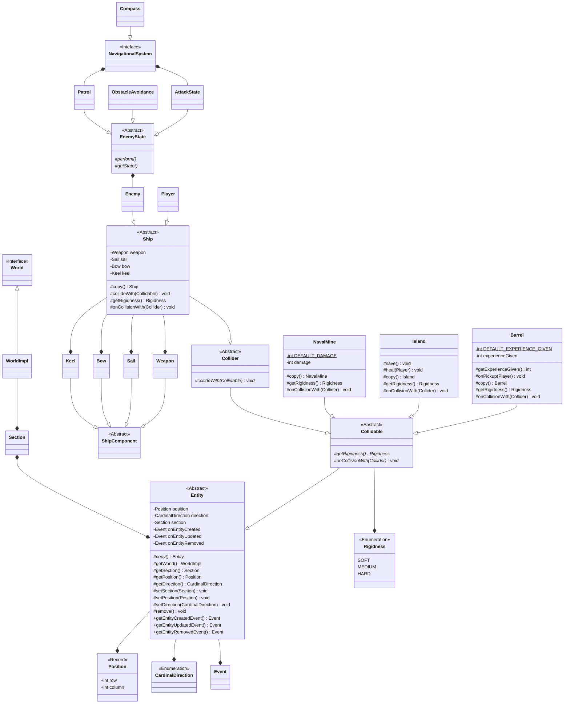

```mermaid
classDiagram

class Entity
<<Abstract>> Entity
Entity : -Position position
Entity --* Position
Entity : -CardinalDirection direction
Entity --* CardinalDirection
Entity : -Section section
Entity --* Event
Entity : -Event onEntityCreated
Entity : -Event onEntityUpdated
Entity : -Event onEntityRemoved
Entity : #copy()* Entity
Entity : #getWorld() WorldImpl
Entity : #getSection() Section
Entity : #getPosition() Position
Entity : #getDirection() CardinalDirection
Entity : #setSection(Section) void
Entity : #setPosition(Position) void
Entity : #setDirection(CardinalDirection) void
Entity : #remove() void
Entity : +getEntityCreatedEvent() Event
Entity : +getEntityUpdatedEvent() Event
Entity : +getEntityRemovedEvent() Event

class Collidable
<<Abstract>> Collidable
Collidable --|> Entity
Collidable --* Rigidness
Collidable : #getRigidness()* Rigidness
Collidable : #onCollisionWith(Collider)* void

class Rigidness
<<Enumeration>> Rigidness
Rigidness : SOFT
Rigidness : MEDIUM
Rigidness : HARD

class Barrel
Barrel --|> Collidable
Barrel : -int DEFAULT_EXPERIENCE_GIVEN$
Barrel : -int experienceGiven
Barrel : #getExperienceGiven() int
Barrel : #onPickup(Player) void
Barrel : #copy() Barrel
Barrel : #getRigidness() Rigidness
Barrel : #onCollisionWith(Collider) void

class Island
Island --|> Collidable
Island : #save() void
Island : #heal(Player) void
Island : #copy() Island
Island : #getRigidness() Rigidness
Island : #onCollisionWith(Collider) void

class NavalMine
NavalMine --|> Collidable
NavalMine : -int DEFAULT_DAMAGE$
NavalMine : -int damage
NavalMine : #copy() NavalMine
NavalMine : #getRigidness() Rigidness
NavalMine : #onCollisionWith(Collider) void

class Collider
<<Abstract>> Collider
Collider --|> Collidable
Collider : #collideWith(Collidable)* void

class Ship
<<Abstract>> Ship
Ship --|> Collider
Ship : -Weapon weapon
Ship --* Weapon
Ship : -Sail sail
Ship --* Sail
Ship : -Bow bow
Ship --* Bow
Ship : -Keel keel
Ship --* Keel
Ship : #copy() Ship
Ship : #collideWith(Collidable) void
Ship : #getRigidness() Rigidness
Ship : #onCollisionWith(Collider) void

class ShipComponent
<<Abstract>> ShipComponent

class Weapon
Weapon --|> ShipComponent 

class Sail
Sail --|> ShipComponent

class Bow
Bow --|> ShipComponent

class Keel
Keel --|> ShipComponent

class Player
Player --|> Ship

class Enemy
Enemy --|> Ship
EnemyState *-- Enemy

class EnemyState
<<Abstract>> EnemyState
EnemyState : #perform()*
EnemyState : #getState()*

class AttackState
AttackState --|> EnemyState
NavigationalSystem *-- AttackState

class ObstacleAvoidance
ObstacleAvoidance --|> EnemyState

class Patrol
Patrol --|> EnemyState
NavigationalSystem *-- Patrol

class NavigationalSystem
<<Inteface>> NavigationalSystem

class Compass
Compass --|> NavigationalSystem

class Section
Section *--* Entity

class World
<<Interface>> World

class WorldImpl
WorldImpl --* Section
World <|-- WorldImpl

class Position
<<Record>> Position
Position : +int row
Position : +int column

class CardinalDirection
<<Enumeration>> CardinalDirection

class Event
```
